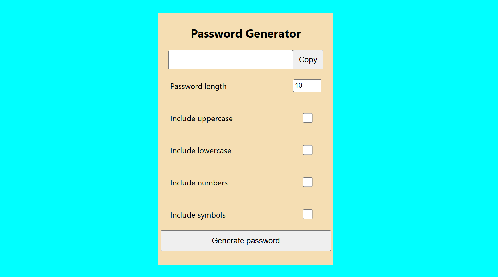
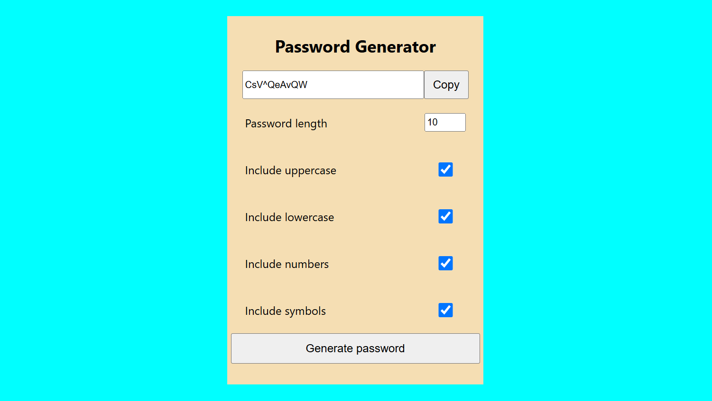

# 🔑 Password Generator — React App

A clean and functional password generator built with React.js. Customise your password length and character types — uppercase, lowercase, numbers and symbols — then generate and copy to clipboard instantly.



## 🛠️ Built With

- React.js
- Create React App
- CSS3
- JavaScript (ES6+)

## ✨ Features

- 🔢 Custom password length input
- 🔠 Toggle uppercase letters
- 🔡 Toggle lowercase letters
- 🔢 Toggle numbers
- 🔣 Toggle symbols
- 📋 Copy to clipboard with one click
- ⚡ Instant password generation
- 🎨 Warm beige UI theme
- 📱 Fully responsive design

## 📸 Screenshots

### Password Generator


### Generated Password



## 🚀 Getting Started

### Prerequisites
- Node.js installed
- npm

### Installation

1. Clone the repo
```bash
git clone https://github.com/pratham-amin/password-generator
```

2. Navigate to the project folder
```bash
cd password-generator
```

3. Install dependencies
```bash
npm install
```

4. Start the development server
```bash
npm start
```

5. Open your browser and visit
```bash
http://localhost:3000
```

### Build for Production
```bash
npm run build
```

## ⚙️ How It Works

1. Set your desired password length (default: 10)
2. Select character types to include:
   - ☑️ Uppercase letters (A-Z)
   - ☑️ Lowercase letters (a-z)
   - ☑️ Numbers (0-9)
   - ☑️ Symbols (!@#$%^&*)
3. Click **Generate Password**
4. Click **Copy** to copy to clipboard instantly

## 🧩 Character Sets

| Type | Characters |
|---|---|
| Uppercase | A B C D E F ... Z |
| Lowercase | a b c d e f ... z |
| Numbers | 0 1 2 3 4 5 6 7 8 9 |
| Symbols | ! @ # $ % ^ & * ( ) _ + |

## 🎨 Customisation

| What to change | Where |
|---|---|
| Default password length | `PasswordGenerator.jsx` — update default state |
| Colour theme | `App.css` — update background and card colours |
| Character sets | `PasswordGenerator.jsx` — update character strings |
| Min/max length | `PasswordGenerator.jsx` — update input constraints |

## 👨‍💻 About the Developer

Built by **Pratham Sathish** — Frontend Developer and MIT student at Deakin University, Burwood.

- 📍 Burwood, VIC, Australia
- 📧 sprathamamin23@gmail.com
- 💼 [LinkedIn](https://linkedin.com/in/pratham-s-5a3856290)
- 💻 [GitHub](https://github.com/pratham-amin)
- 🌐 [Portfolio](https://portfolio-pratham-amin.vercel.app)

